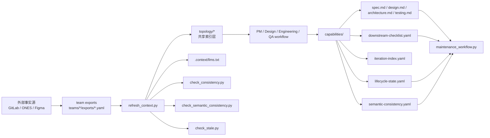
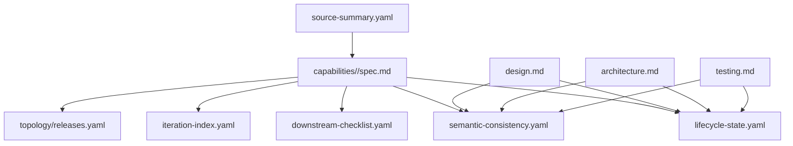
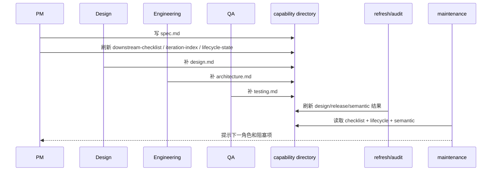
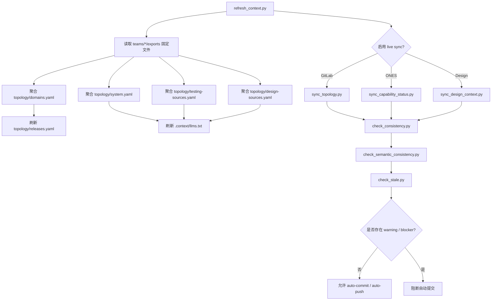
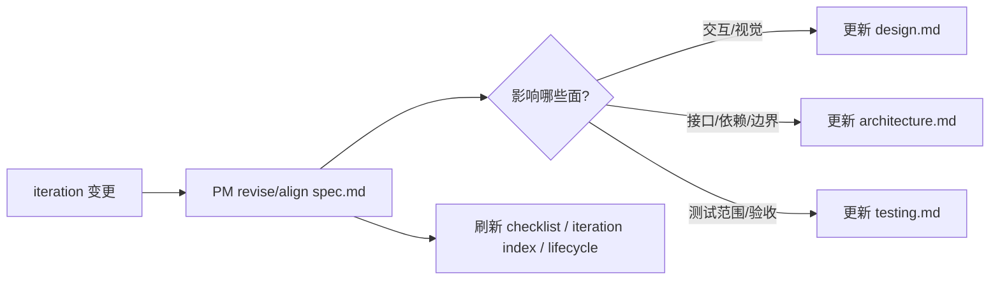

# Context Hub 研发周期工作流指南

> 这是一份给团队成员直接使用的总览文档。目标不是解释所有实现细节，而是让人快速看明白：`context-hub` 是什么、目录怎么组织、每个角色该做什么、一个 capability 怎样从需求走到设计、研发、测试和审计。

## 1. 先看结论

`context-hub` 是一个共享 Git 仓库，用来维护“项目可共享的事实摘要”和“围绕 capability 的主工作文档”。

- 它不是 GitLab、ONES、Figma 的替代品
- 它也不是按迭代复制多套文档的归档仓库
- 它维护的是一个 capability 的长期单一事实源

如果只想先理解最重要的三件事，可以记住：

1. 一个 capability 长期维护在同一个目录下。
2. PM 改 `spec.md` 后，Design / Engineering / QA 只同步受影响的文档。
3. `refresh_context.py`、`maintenance_workflow.py`、`check_*` 脚本负责把共享索引、审计和阻塞信息维护起来。

## 2. 一张图看整体



这张图可以读成两条主线：

- 文档主线：PM / Design / Engineering / QA 围绕同一个 capability 维护主文档。
- 聚合主线：各团队把可共享摘要导出到 `teams/*/exports/`，再由 `refresh_context.py` 聚合到共享索引层并触发审计。

## 3. 预期的项目组织形式

### 3.1 Hub 根目录

推荐把一个项目的共享上下文组织成下面这个结构：

```text
my-project-hub/
├── IDENTITY.md
├── topology/
│   ├── domains.yaml
│   ├── ownership.yaml
│   ├── system.yaml
│   ├── testing-sources.yaml
│   ├── design-sources.yaml
│   └── releases.yaml
├── capabilities/
│   ├── _templates/
│   └── voting/
│       ├── spec.md
│       ├── design.md
│       ├── architecture.md
│       ├── testing.md
│       ├── source-summary.yaml
│       ├── downstream-checklist.yaml
│       ├── iteration-index.yaml
│       ├── lifecycle-state.yaml
│       └── semantic-consistency.yaml
├── decisions/
│   ├── _index.md
│   └── _template.md
├── teams/
│   ├── product/exports/
│   ├── design/exports/
│   ├── engineering/exports/
│   └── qa/exports/
├── .context/
│   └── llms.txt
├── templates/
│   ├── spec.md
│   ├── design.md
│   ├── architecture.md
│   ├── testing.md
│   ├── design-fragment.yaml
│   └── role-intake/
└── scripts/
    ├── create_capability.py
    ├── refresh_context.py
    ├── sync_topology.py
    ├── sync_capability_status.py
    ├── sync_design_context.py
    ├── bootstrap_credentials_check.py
    ├── check_consistency.py
    ├── check_semantic_consistency.py
    ├── check_stale.py
    ├── runtime/
    ├── integrations/
    └── workflows/
```

### 3.2 capability 目录为什么要这样组织



每个文件的职责可以简单理解为：

- `spec.md`：需求和验收的主入口。
- `design.md`：交互、页面、状态和视觉约束。
- `architecture.md`：接口、依赖、边界、实现约束。
- `testing.md`：测试范围、环境、回归与验收口径。
- `source-summary.yaml`：外部任务来源摘要。
- `downstream-checklist.yaml`：PM 更新后哪些 downstream 角色还需要跟进。
- `iteration-index.yaml`：当前 capability 属于哪个 iteration / release，以及累计多少次 PM 变更。
- `lifecycle-state.yaml`：各角色当前状态、阻塞项、下一步建议。
- `semantic-consistency.yaml`：最近一次语义一致性审计结果。

## 4. 每个角色在维护什么

| 角色 | 主要输入 | 主要输出 | 典型动作 |
| --- | --- | --- | --- |
| PM | ONES 需求、当前 `spec.md`、共享索引 | `spec.md` | `create` / `revise` / `align` |
| Design | Figma、当前 `design.md`、`spec.md` | `design.md` | `extend` / `revise` / `align` |
| Engineering | GitLab repo、当前 `architecture.md`、`spec.md` | `architecture.md` | `extend` / `revise` / `align` |
| QA | ONES 测试任务、`testing-sources.yaml`、当前 `testing.md` | `testing.md` | `extend` / `revise` / `align` |
| Maintenance | capability 全部 control plane 文件、共享 topology | 审计结果 | `audit` |

角色与主文档的关系如下：



### 4.1 文件级速查

| 你要表达的内容 | 应该写到哪里 |
| --- | --- |
| 业务目标、范围、规则、验收标准 | `capabilities/<name>/spec.md` |
| 页面流程、交互状态、视觉约束、设计链接 | `capabilities/<name>/design.md` |
| 服务边界、接口、依赖、实现约束 | `capabilities/<name>/architecture.md` |
| 回归范围、测试环境、验收口径、风险 | `capabilities/<name>/testing.md` |
| capability 对应的外部任务摘要 | `capabilities/<name>/source-summary.yaml` |
| PM 变更后 downstream 是否还没跟上 | `capabilities/<name>/downstream-checklist.yaml` |
| 当前 iteration / release 和累计变更次数 | `capabilities/<name>/iteration-index.yaml` |
| 当前 capability 的角色状态和阻塞项 | `capabilities/<name>/lifecycle-state.yaml` |
| 跨文档语义冲突审计结果 | `capabilities/<name>/semantic-consistency.yaml` |
| 全局 capability 索引和 `ones_tasks` | `topology/domains.yaml` |
| 全局 ownership | `topology/ownership.yaml` |
| 全局服务/依赖摘要 | `topology/system.yaml` |
| 全局测试来源摘要 | `topology/testing-sources.yaml` |
| 全局设计来源摘要 | `topology/design-sources.yaml` |
| 全局 release 视图 | `topology/releases.yaml` |

## 5. 一个 capability 从 0 到 1 怎么走

### 第 1 步：初始化一个 hub

```bash
python3 skills/context-hub/scripts/init_context_hub.py \
  --output /tmp/meeting-control-hub \
  --name "会议控制平台" \
  --id meeting-control
```

你会得到一个可运行的共享上下文仓库骨架，包括：

- `topology/*`
- `capabilities/_templates/`
- `teams/*/exports/`
- `scripts/workflows/`
- `scripts/runtime/` 和 `scripts/integrations/`

### 第 2 步：创建 capability

```bash
python3 skills/context-hub/scripts/create_capability.py \
  --hub /tmp/meeting-control-hub \
  --name voting \
  --title "投票功能" \
  --domain meeting-control \
  --ones-task TASK-1
```

这一步会创建 `capabilities/voting/`，并同步维护：

- `topology/domains.yaml`
- `topology/ownership.yaml`
- `.context/llms.txt`

### 第 3 步：PM 先落 `spec.md`

```bash
python3 skills/context-hub/scripts/workflows/pm_workflow.py \
  --hub /tmp/meeting-control-hub \
  --capability voting \
  --action create \
  --domain meeting-control \
  --iteration "Sprint 12" \
  --release "2026.04" \
  --content-file /tmp/spec.md \
  --output-format json
```

这一步非常关键，因为它不只是写 `spec.md`，还会顺带刷新：

- `downstream-checklist.yaml`
- `iteration-index.yaml`
- `lifecycle-state.yaml`
- `topology/releases.yaml`

### 第 4 步：Design / Engineering / QA 只跟进受影响的文档

如果需求变更影响了设计，就更新 `design.md`：

```bash
python3 skills/context-hub/scripts/workflows/design_workflow.py \
  --hub /tmp/meeting-control-hub \
  --capability voting \
  --action align \
  --figma-url https://www.figma.com/design/FILE123/Voting \
  --content-file /tmp/design.md \
  --output-format json
```

如果需求变更影响了研发边界，就更新 `architecture.md`：

```bash
python3 skills/context-hub/scripts/workflows/engineering_workflow.py \
  --hub /tmp/meeting-control-hub \
  --capability voting \
  --action revise \
  --repo-url git@itgitlab.xylink.com:group/voting-service.git \
  --gitlab-branch main \
  --content-file /tmp/architecture.md \
  --output-format json
```

如果需求变更影响了测试范围和验收，就更新 `testing.md`：

```bash
python3 skills/context-hub/scripts/workflows/qa_workflow.py \
  --hub /tmp/meeting-control-hub \
  --capability voting \
  --action extend \
  --content-file /tmp/testing.md \
  --output-format json
```

维护原则不是“每次迭代把四份文档全重写一遍”，而是：

- 先由 PM 更新 `spec.md`
- downstream 角色只更新受影响的主文档
- 同一个 capability 始终在同一个目录持续演进

### 第 5 步：刷新共享索引和聚合摘要

```bash
python3 skills/context-hub/scripts/refresh_context.py \
  /tmp/meeting-control-hub \
  --sync-gitlab \
  --sync-ones \
  --sync-design
```

这一步会聚合 team exports，并按需刷新：

- `topology/system.yaml`
- `topology/design-sources.yaml`
- `topology/testing-sources.yaml`
- `topology/releases.yaml`
- `.context/llms.txt`

同时它还会自动执行：

- `check_consistency.py`
- `check_semantic_consistency.py`
- `check_stale.py`

它的编排逻辑可以简化成下面这张图：



### 第 6 步：用 maintenance 看当前缺口

```bash
python3 skills/context-hub/scripts/workflows/maintenance_workflow.py \
  --hub /tmp/meeting-control-hub \
  --capability voting \
  --output-format json
```

返回结果最值得关注的是：

- `pending_roles`
- `blocking_issues`
- `suggested_repairs`
- `next_role`
- `next_action`

也就是说，maintenance 不是在写新文档，而是在回答两个管理问题：

1. 当前这个 capability 还缺谁来补？
2. 为什么会卡住，下一步最合理的是谁做什么？

## 6. 迭代变更时应该怎么维护

很多团队最容易犯的错，是给每个 iteration 复制一套新的 `spec/design/architecture/testing`。`context-hub` 不建议这么做。

推荐规则如下：

- 同一个 capability 跨 iteration 持续维护在同一个目录下。
- `spec.md` 是变更主入口，需求变化至少更新它。
- `design.md` / `architecture.md` / `testing.md` 只在受影响时跟进。
- `iteration-index.yaml` 负责记录当前 iteration / release。
- 技术决策边界变化时，再补 `decisions/*.md`。

可以把它理解成：



## 7. 什么情况下会被阻断

### 7.1 live 读取的三种状态

workflow 访问外部系统时，统一会落到三种状态之一：

- `live_ok`：成功读取实时事实，可以继续正常写入
- `fallback_to_hub`：实时读取失败，但可以退回 hub 摘要继续推进
- `blocked`：缺少必要事实，不能安全继续写入

### 7.2 自动提交和推送不会在有警告时继续

`refresh_context.py` 的 `auto-commit` / `auto-push` 会受审计 gating 影响。

如果出现下面这些情况，自动提交流程应该停住：

- `check_consistency.py` 有 warning
- `check_semantic_consistency.py` 有 warning
- `check_stale.py` 暴露关键 blocker

这条规则的目的不是保守，而是防止“把明显不一致的状态自动扩散出去”。

## 8. 常见前提和限制

- 只有 PM 的 `create` 允许 bootstrap 不存在的 capability；Design / Engineering / QA 都要求 capability 已存在。
- 所有会改主文档的 workflow 都必须传 `--content-file`；没有草稿文件就不会写入目标文档。
- `maintenance_workflow.py` 是只读审计，不负责直接替你补文档。
- `refresh_context.py` 只认固定的 team export 文件名：
  `product/domains-fragment.yaml`、`engineering/system-fragment.yaml`、`qa/testing-fragment.yaml`、`design/design-fragment.yaml`。
- GitLab 增量同步不是只给一个 repo URL 就够，必须同时给 `repo URL + branch + commit SHA`。
- `check_consistency.py` 和 `check_stale.py` 会区分：
  `0 = 通过`、`1 = 只有 warning`、`2 = 存在 error 或 blocker`。
- `check_semantic_consistency.py` 会刷新 `semantic-consistency.yaml`；有 issue 时返回 `2`。
- `source-summary.yaml` 只有在 `topology/domains.yaml` 里配置了 `ones_tasks` 的 capability 下才会生成。
- 共享层只保存摘要、索引、链接、ownership、freshness，不保存敏感原文。

## 9. 团队日常可以怎么用

### 新 capability 启动

1. 初始化 hub 或进入已有 hub
2. `create_capability.py` 建立 capability
3. PM 写第一版 `spec.md`
4. downstream 角色按影响面补齐文档
5. 跑一次 `refresh_context.py`
6. 用 `maintenance_workflow.py` 看是否还有缺口

### 迭代需求变更

1. PM 用 `revise` 或 `align` 更新 `spec.md`
2. 相关角色只补受影响文档
3. 需要时刷新 ONES / GitLab / design 摘要
4. 跑 `refresh_context.py` 或最小审计命令

### 合并前或周期性巡检

```bash
python3 skills/context-hub/scripts/check_consistency.py --hub /tmp/meeting-control-hub
python3 skills/context-hub/scripts/check_semantic_consistency.py --hub /tmp/meeting-control-hub
python3 skills/context-hub/scripts/check_stale.py --hub /tmp/meeting-control-hub
```

## 10. 文档阅读顺序建议

如果你是第一次接触这个仓库，推荐这样读：

1. 先看本文，理解整体工作方式和目录组织。
2. 再看 [README.md](../../README.md)，理解项目定位和常用命令。
3. 需要确认正式 contract 时看 [当前实现规范](../context-hub-specification.md)。
4. 需要追溯设计决策时，再看 `docs/superpowers/specs/` 下的设计文档。

## 11. 一句话判断现在是不是“维护到位”

一个 capability 的状态大致可以认为是健康的，当且仅当：

- `spec.md`、`design.md`、`architecture.md`、`testing.md` 都已建立且与当前阶段匹配
- `downstream-checklist.yaml` 没有长期未处理的 pending role
- `lifecycle-state.yaml` 没有持续 blocker
- `semantic-consistency.yaml` 没有高严重度冲突
- `topology/releases.yaml`、`design-sources.yaml`、`system.yaml`、`testing-sources.yaml` 与当前事实同步

如果这些条件基本满足，团队就能把 `context-hub` 当成一个可持续维护的 capability control plane 来使用，而不只是一个文档堆放目录。
